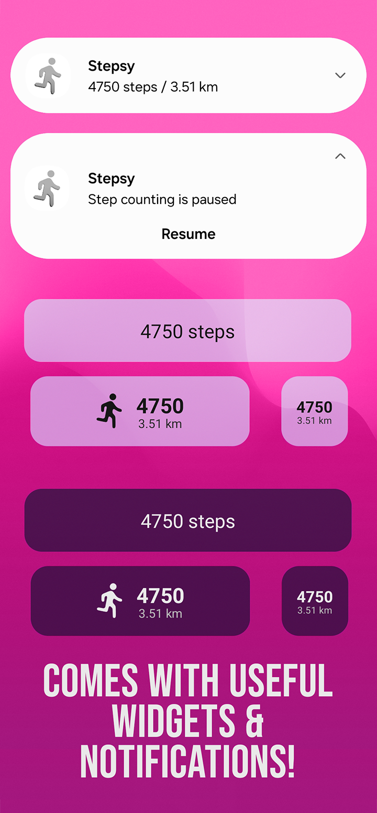

  

#

  
  
  
  

Stepsy is a lightweight Android app for tracking your daily steps using your phone’s built-in sensors. It focuses on simplicity, battery efficiency, and full local data storage.

Stay active, monitor your progress, and reach your fitness goals — all through a clean, minimal interface with virtually no battery impact.

- Calculate distance and calories burned based on your height and weight
- Visualize your data with dynamic, interactive charts
- Export your data to a CSV file for backup and easy analysis
- Display your today's step count with a widget
- Analyze the progress with dedicated Achievements screen

🌟 [Tricks you may want to know](TRICKS.md)

## Screenshots

  
  
  
  

## Download

  

## Dependencies

- [MPAndroidChart](https://github.com/PhilJay/MPAndroidChart) - Apache License 2.0

## Credits

+ Stepsy is a fork of [nvllz/stepsy](https://github.com/nvllz/stepsy)
+ Stepsy is a fork of [Motionmate](https://github.com/0xf4b1/motionmate), and would never be released without the idea of its original creator, [0xf4b1](https://github.com/0xf4b1).
