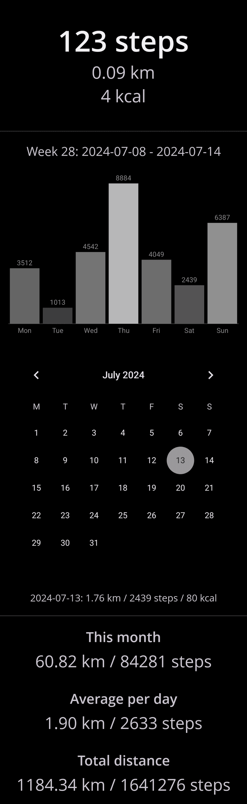

#

Stepsy, a fork of [Motionmate](https://github.com/0xf4b1/motionmate), is a lightweight Android app that helps you track your daily steps using your phone's built-in sensors. Stay active, track your progress, and reach your fitness goals - all with a clean, minimal interface and no real impact on your battery.

- Calculate distance and calories burned based on your height and weight
- Visualize your data with dynamic, interactive charts
- Export your data to a CSV file for backup and easy analysis

## Screenshots
 

# Stepsy vs Motionmate - differences

- Made the step counting more efficient
- Revamped overall design for a cleaner look  
- Improved compatibility with recent Android versions (updated permission handling)  
- Removed deprecated code for better maintainability  
- Fixed numerous bugs (including issues with charts, settings, backups, and step data handling)  
- Optimized database writes for better reliability  
- Added support for custom date formats  
- Replaced "step width" with intuitive height and weight sliders  
- Removed custom activities
- Updated the "Play" button — now functions as a pause toggle for step counting  
- Refreshed app icon with a new design  
- Introduced dynamic charts with value-based bar highlights  
- Enhanced notification system for improved user feedback

## Download

Download the apk directly from the [GitHub releases](https://github.com/nvllz/stepsy/releases) page.

## License

The project is licensed under GPLv3.

## Dependencies

- [MPAndroidChart](https://github.com/PhilJay/MPAndroidChart) - Apache License 2.0
